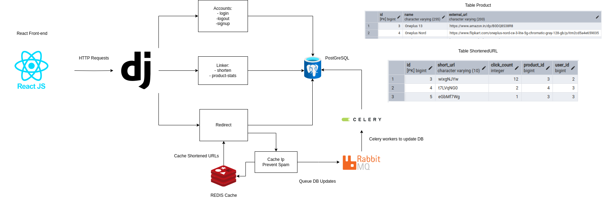

# Impact URL - URL Shortening Service for Influencers

Impact URL is a robust and scalable URL shortening service tailored for influencers and online marketers to promote products. The platform not only generates shortened URLs but also tracks critical analytics, such as the number of clicks, to measure the performance of campaigns. Designed with performance, security, and usability in mind, Impact URL ensures seamless redirection and real-time tracking.

---

## 🏗 **Architecture Overview**



---

## 🚀 **Features**

### Core Functionality
- **URL Shortening:** Quickly generate shortened URLs for long product links.
- **Click Tracking:** Monitor total clicks on shortened URLs for performance analytics.
- **Real-Time Redirects:** Seamlessly redirect users to the original URL without delays.

### Analytics Dashboard
- **Track Metrics:** View original URLs, shortened URLs, and total clicks.
- **Create Links:** Easily generate new shortened URLs from the dashboard.

### Performance Enhancements
- **Caching:** Utilize Redis to store frequently accessed shortened URLs for faster redirection.
- **Asynchronous Processing:** Celery with RabbitMQ to handle click count updates without slowing redirects.
- **Load Testing:** Simulate high traffic using Locust to ensure system scalability.

### Security Features
- **Anti-Spam Protection:** Prevent bots from inflating click counts using:
  - IP and User-Agent tracking.
  - Rate limiting and visitor caching.

---

## 🛠 **Tech Stack**

### **Backend:**
- **Django (Python):** Handles URL shortening, API endpoints, and database interactions.
- **Django REST Framework:** Provides a RESTful API for frontend integration.
- **Celery + RabbitMQ:** Asynchronous task processing for click count updates.
- **Redis:** Caching frequently accessed URLs and visitor tracking.
- **PostgreSQL:** Relational database for storing URL mappings and analytics.
- **JWT Authentication:** Secure influencer login and session management.

### **Frontend:**
- **React + TypeScript:** Interactive dashboard for influencers.
- **Axios:** Handles API requests for seamless data fetching.

## 🏎 **Getting Started**

### Prerequisites
- Python 3.9+
- Node.js 16+
- PostgreSQL installed and running
- Redis installed for caching

### Other Dependencies:
- configure redis and PostgreSQL in settings.py

### Backend Setup
```bash
# Create and activate virtual environment
python -m venv venv
source venv/bin/activate  # On Windows use `venv\Scripts\activate`

# Install dependencies
pip install -r requirements.txt

# Run migrations and start the server
python manage.py runserver 0.0.0.0:8000

# start Celery worker
celery -A ImpactLink worker --loglevel=info
